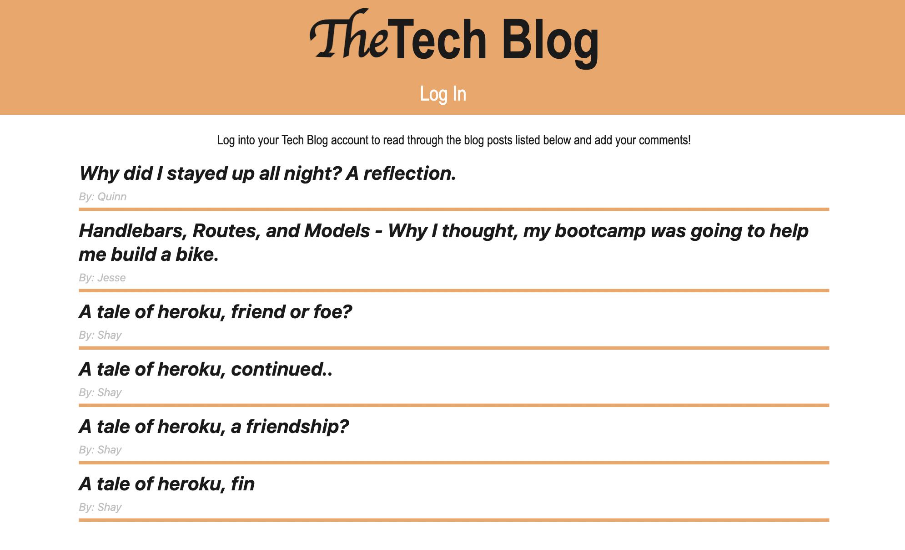
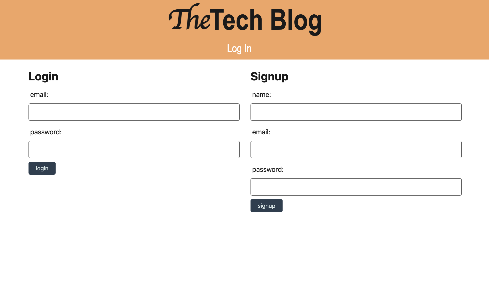
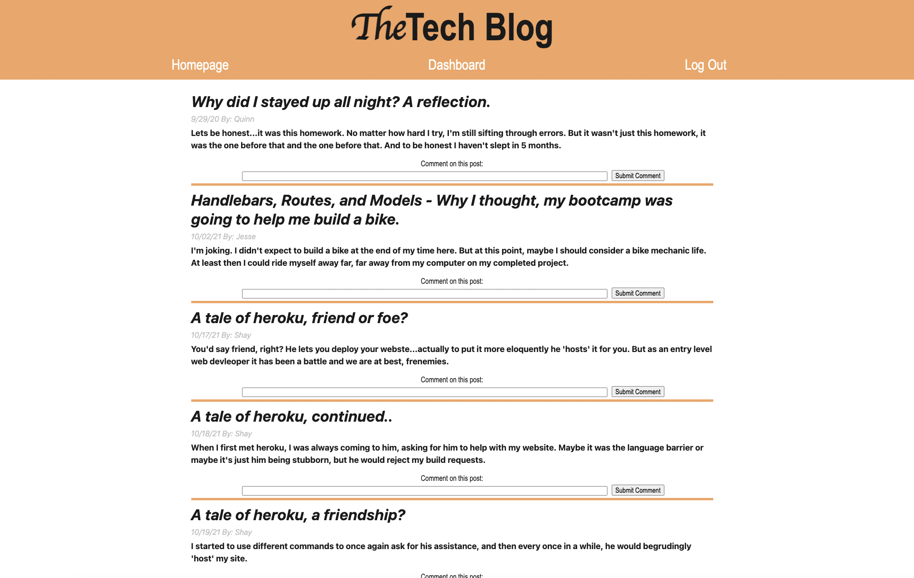

# Tech-Blog

## Description
A CMS-style blog site similar to a Wordpress site, where developers can publish their blog posts and comment on other developers’ posts as well. The site is deployed to Heroku and follows MVC paradigm in its architectural structure, using Handlebars.js as the templating language, Sequelize as the ORM, and the express-session npm package for authentication.

## Page Preview

## Technologies and Tools
Heroku, Express-Handlebars, Sequalize, Express-Session Javascript, CSS, HTML, 

## Links
* Deployed: https://rocky-caverns-74706.herokuapp.com/
* Repo: https://github.com/evapopp/Tech-Blog

## License
MIT

## Author
Eva Popp, Full Stack Developer
* Email: evapopp8@gmail.com
* Github: https://github.com/evapopp
